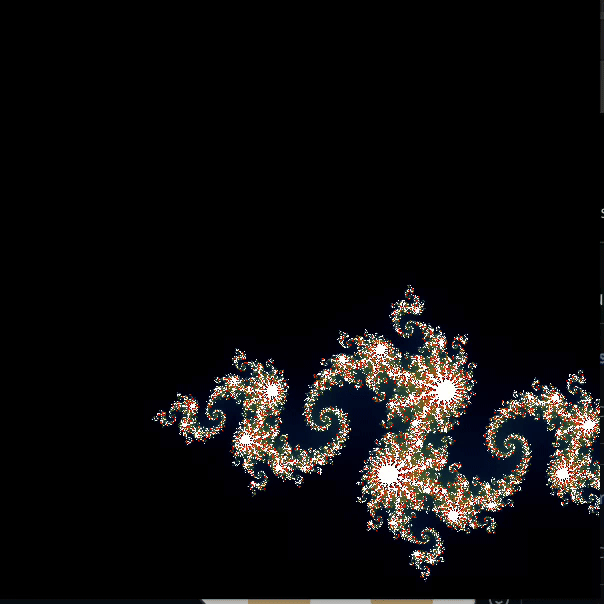
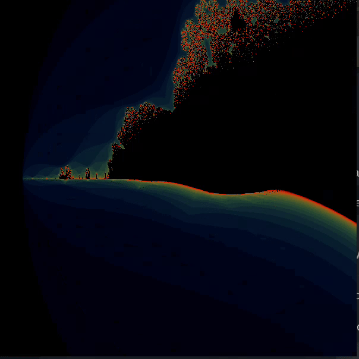

# Mini-Pacman 🎮


fract-ol 42 project

# Mandelbrot


# Julia


# Burning_ship



---

## 📜 Project Description

Fract-ol is a graphical project that generates beautiful fractals using the MiniLibX graphical library in C.

The project’s main goal is to explore complex numbers, iterations, and graphics programming by rendering different types of mathematical fractals in real-time.  

It offers a great introduction to:

    - Working with complex mathematical formulas
    
    - Handling low-level graphics (pixel-by-pixel drawing)

    - Event handling (keyboard, mouse interactions)

    - Optimizing rendering loops

---

## 🎯 Objectives

- Render multiple famous fractals, including:

        Mandelbrot set

        Julia set

        (Optional) Other fractals like the Burning Ship

- Allow user interaction:

        Zoom in / out

        Move across the fractal

        Change colors

- Handle mouse and keyboard events smoothly.

- Ensure high performance and accuracy in rendering.


## How to Run

1. **Clone the repository:**
   ```bash
   git clone <repo copied>
   cd fract_ol_42

2. Clone MLX library if you haven't already.

         git clone https://github.com/42Paris/minilibx-linux.git mlx
  
3. Compile the project:
      
        make

5. Run the game:
    Mandelbrot set:  
            ./fractol mandelbrot
    julia set:  
            ./fractol julia <imaginair> <real>
    burning_ship set:
            ./fractol burning_ship

---


# 🎮 Controls:

        Key                 | Action  
        Mouse Wheel / + / - | zoom in/out  
        Arrow Keys          | Move up/down/left/right	   
        (+-, pm)keys        | growth iteration(+ or p) else (- or m)  
        n key               | Reset fractal  
        r-g-b key           | Enforce a color r(red) g(green) b(blue)
        ESC                 | Quit the game  
